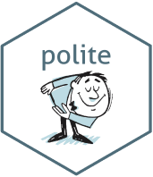
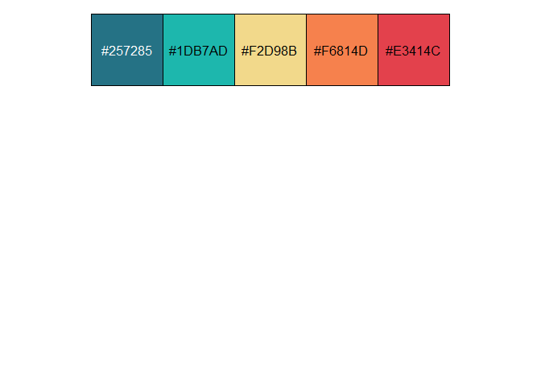

<!-- README.md is generated from README.Rmd. Please edit that file -->

# polite 

<!-- badges: start -->

[](https://ci.appveyor.com/project/dmi3kno/polite)
[](https://app.codecov.io/gh/dmi3kno/polite?branch=master)
[](https://CRAN.R-project.org/package=polite)
[](https://lifecycle.r-lib.org/articles/stages.html#maturing)
[](https://github.com/dmi3kno/polite/actions/workflows/R-CMD-check.yaml)
<!-- badges: end -->

The goal of `polite` is to promote responsible web etiquette.

> **“bow and scrape” (verb):**
>
> 1)  To make a deep bow with the right leg drawn back (thus scraping
>     the floor), left hand pressed across the abdomen, right arm held
>     aside.
>
> 2)  *(idiomatic, by extension)* To behave in a servile, obsequious, or
>     excessively polite manner. \[1\] Source: *Wiktionary, The free
>     dictionary*

The package’s two main functions `bow` and `scrape` define and realize a
web harvesting session. `bow` is used to introduce the client to the
host and ask for permission to scrape (by inquiring against the host’s
`robots.txt` file), while `scrape` is the main function for retrieving
data from the remote server. Once the connection is established, there’s
no need to `bow` again. Rather, in order to adjust a scraping URL the
user can simply `nod` to the new path, which updates the session’s URL,
making sure that the new location can be negotiated against
`robots.txt`.

The three pillars of a `polite session` are **seeking permission, taking
slowly and never asking twice**.

The package builds on awesome toolkits for defining and managing http
sessions (`httr` and `rvest`), declaring the user agent string and
investigating site policies (`robotstxt`), and utilizing rate-limiting
and response caching (`ratelimitr` and `memoise`).

## Installation

You can install `polite` from [CRAN](https://cran.r-project.org/) with:

``` r
install.packages("polite")
```

Development version of the package can be installed from
[Github](https://github.com/dmi3kno/polite) with:

``` r
install.packages("remotes")
remotes::install_github("dmi3kno/polite")
```

## Basic Example

This is a basic example which shows how to retrieve the list of
semi-soft cheeses from www.cheese.com. Here, we authenticate a session
and then scrape the page with specified parameters. Behind the scenes
`polite` retrieves `robots.txt`, checks the URL and user agent string
against it, caches the call to `robots.txt` and to the web page and
enforces rate limiting.

``` r
library(polite)
library(rvest)

session <- bow("https://www.cheese.com/by_type", force = TRUE)
result <- scrape(session, query=list(t="semi-soft", per_page=100)) %>%
  html_node("#main-body") %>%
  html_nodes("h3") %>%
  html_text()
head(result)
#> [1] "American Cheese"     "Mozzarella"          "Taleggio"           
#> [4] "Fontina Val d'Aosta" "Blue Cheese"         "Jarlsberg"
```

## Extended Example

You can build your own functions that incorporate `bow`, `scrape` (and,
if required, `nod`). Here we will extend our inquiry into cheeses and
will download all cheese names and URLs to their information pages.
Let’s retrieve the number of pages per letter in the alphabetical list,
keeping the number of results per page to 100 to minimize number of web
requests.

``` r
library(polite)
library(rvest)
library(purrr)
library(dplyr)

session <- bow("https://www.cheese.com/alphabetical")

# this is only to illustrate the example.
letters <- letters[1:3] # delete this line to scrape all letters

responses <- map(letters, ~scrape(session, query = list(per_page=100,i=.x)) )
results <- map(responses, ~html_nodes(.x, "#id_page li") %>%
                           html_text(trim = TRUE) %>%
                           as.numeric() %>%
                           tail(1) ) %>%
           map(~pluck(.x, 1, .default=1))
pages_df <- tibble(letter = rep.int(letters, times=unlist(results)),
                   pages = unlist(map(results, ~seq.int(from=1, to=.x))))
pages_df
#> # A tibble: 3 × 2
#>   letter pages
#>   <chr>  <int>
#> 1 a          1
#> 2 b          1
#> 3 c          1
```

Now that we know how many pages to retrieve from each letter page, let’s
rotate over letter pages and retrieve cheese names and underlying links
to cheese details. We will need to write a helper function. Our session
is still valid and we don’t need to `nod` again, because we will not be
modifying a page URL, only its parameters (note that the field `url` is
missing from `scrape` function).

``` r
get_cheese_page <- function(letter, pages){
 lnks <- scrape(session, query=list(per_page=100,i=letter,page=pages)) %>%
    html_nodes("h3 a")
tibble(name=lnks %>% html_text(),
       link=lnks %>% html_attr("href"))
}

df <- pages_df %>% pmap_df(get_cheese_page)
df
#> # A tibble: 60 × 2
#>    name                    link                     
#>    <chr>                   <chr>                    
#>  1 Aarewasser              /aarewasser/             
#>  2 Abbaye de Belloc        /abbaye-de-belloc/       
#>  3 Abbaye de Belval        /abbaye-de-belval/       
#>  4 Abbaye de Citeaux       /abbaye-de-citeaux/      
#>  5 Abbaye de Tamié         /tamie/                  
#>  6 Abbaye de Timadeuc      /abbaye-de-timadeuc/     
#>  7 Abbaye du Mont des Cats /abbaye-du-mont-des-cats/
#>  8 Abbot’s Gold            /abbots-gold/            
#>  9 Abertam                 /abertam/                
#> 10 Abondance               /abondance/              
#> # ℹ 50 more rows
```

## Another example

Bob Rudis is one the vocal proponents of an online etiquette in the R
community. If you have never seen his robots.txt file, you should
definitely [check it out](https://rud.is/robots.txt)! Lets look at his
[blog](https://rud.is/b/). We don’t know how many pages will the gallery
return, so we keep going until there’s no more “Older posts” button.
Note that I first `bow` to the host and then simply `nod` to the current
scraping page inside the `while` loop.

``` r
    library(polite)
    library(rvest)

    hrbrmstr_posts <- data.frame()
    url <- "https://rud.is/b/"
    session <- bow(url)

    while(!is.na(url)){
      # make it verbose
      message("Scraping ", url)
      # nod and scrape
      current_page <- nod(session, url) %>%
        scrape(verbose=TRUE)
      # extract post titles
      hrbrmstr_posts <- current_page %>%
        html_nodes(".entry-title a") %>%
        polite::html_attrs_dfr() %>%
        rbind(hrbrmstr_posts)
      # see if there's "Older posts" button
      url <- current_page %>%
        html_node(".nav-previous a") %>%
        html_attr("href")
    } # end while loop

    tibble::as_tibble(hrbrmstr_posts)
    #> # A tibble: 578 x3
```

We organize the data into the tidy format and append it to our empty
data frame. At the end we will discover that Bob has written over 570
blog articles, which I very much recommend anyone to check out.

## Polite for package developers

If you are developing a package which accesses the web, `polite` can be
used either as a *template*, or as a *backend* for your polite web
session.

### Polite template

Just before its ascension to CRAN, the package acquired new
functionality for helping package developers get started on creating
polite web tools for the users. Any modern package developer is probably
familiar with excellent [`usethis`
package](https://github.com/r-lib/usethis) by Rstudio team. `usethis` is
a collection of scripts for automating package development workflow.
Many `usethis` functions automating repetitive tasks start with prefix
`use_` indicating that what followed will be adopted and “used” by the
package user developes. For details about `use_` family of functions,
see [package
documentation](https://usethis.r-lib.org/reference/index.html).

`{polite}` has one usethis-like function called `polite::use_manners()`.

``` r
polite::use_manners()
```

When called within the analysis (or package) directory, it creates a new
file called `R/polite-scrape.R` (creating `R` directory if necessary)
and populates it with template functions for creating polite
web-scraping session. The functions provided by `polite::use_manners()`
are drop-in replacements for two of the most popular tools in
web-accessing R ecosystem: `read_html()` and `download.file()`. The only
difference is that these functions have `polite_` prefix. In all other
respects they should have look and feel of the original, i.e. in most
cases you should be able to simply replace calls to `read_html()` with
`polite_read_html()` and `download.file` with `polite_download_file()`
and your code should work (provided you scrape from a `url`, which it
the first required argument in both functions).

### Polite backend

Recent addition to polite package is a
[`purrr`-like](https://purrr.tidyverse.org/reference/index.html#section-adverbs)
adverb `politely()` which can make any web-accessing function “polite”
by wrapping it with a code which delivers on four pillars of polite
session:

> **Introduce Yourself, Seek Permission, Take Slowly and Never Ask
> Twice**.

Adverbs can be useful, when a user (package developer) wants to
“delegate” polite session handling to external package, without
modifying the existing code. The only thing user needs to do is wrap
existing verb with `politely()` and use the new function instead of the
original.

Let’s say you wanted to use `httr::GET` for accessing certain API, such
as `musicbrainz` and extract certain data from a deeply nested list,
returned by the server. Your originally developed code looks like this:

``` r
library(magrittr)
#> 
#> Attaching package: 'magrittr'
#> The following object is masked from 'package:purrr':
#> 
#>     set_names
library(httr)
library(xml2)
library(purrr)

beatles_res <- GET("https://musicbrainz.org/ws/2/artist/",
                   query=list(query="Beatles", limit=10),
                   httr::accept("application/json"))
if(!is.null(beatles_res)) beatles_lst <- httr::content(beatles_res, type = "application/json")

str(beatles_lst, max.level = 2)
#> List of 4
#>  $ created: chr "2026-05-10T19:33:09.681Z"
#>  $ count  : int 274
#>  $ offset : int 0
#>  $ artists:List of 10
#>   ..$ :List of 14
#>   ..$ :List of 18
#>   ..$ :List of 17
#>   ..$ :List of 12
#>   ..$ :List of 13
#>   ..$ :List of 18
#>   ..$ :List of 11
#>   ..$ :List of 8
#>   ..$ :List of 5
#>   ..$ :List of 7
```

This code does not comply with `polite` principles. It does not provide
human-readable user-agent string, it does not consult `robots.txt` about
permissions. It is possible to run this code in the loop and
(accidentally) overwhelm the server with requests. It does not cache the
results, so if this code is re-run again, data will be re-queried.

You could write your own infastructure for handling useragent,
robots.txt, rate limiting and memoisation, or you could simply use an
adverb `politely()` which does all of these things for you.

### Querying colormind.io with polite backend

Here’s an example from using colormind.io API. We will need a couple of
service functions to convert colors between HEX and RGB and to prepare a
json [required by the service](http://colormind.io/api-access/).

``` r
rgba2hex <- function(r,g,b,a) {grDevices::rgb(r, g, b, a, maxColorValue = 255)}

hex2rgba <- function(x, alpha=TRUE){t(grDevices::col2rgb(x, alpha = alpha))}

prepare_colormind_query <- function(x, model){
  lst <- list(model=model)

  if(!is.null(x)){
    x <- utils::head(c(x, rep(NA_character_, times=4)), 5) # pad it with NAs
    x_mat <- hex2rgba(x)
    x_lst <- lapply(seq_len(nrow(x_mat)), function(i) if(x_mat[i,4]==0) "N" else x_mat[i,1:3])
    lst <- c(list(input=x_lst), lst)
  }
  jsonlite::toJSON(lst, auto_unbox = TRUE)
}
```

Now all we have to do is to “wrap” existing function in the `politely`
adverb. Then call the new function insted of original. You dont need to
change anything other than a function name.

``` r
polite_GET <- politely(httr::GET, verbose=TRUE)

#res <- httr::GET("http://colormind.io/list") # was
res <- polite_GET("http://colormind.io/list") # now
#> Fetching robots.txt
#> rt_robotstxt_http_getter: normal http get
#> Warning in request_handler_handler(request = request, handler = on_not_found, :
#> Event: on_not_found
#> Warning in request_handler_handler(request = request, handler =
#> on_file_type_mismatch, : Event: on_file_type_mismatch
#> Warning in request_handler_handler(request = request, handler =
#> on_suspect_content, : Event: on_suspect_content
#> 
#> New copy robots.txt was fetched from http://colormind.io/robots.txt
#> Total of 0 crawl delay rule(s) defined for this host.
#> Your rate will be set to 1 request every 5 second(s).
#> Pausing...
#> Scraping: http://colormind.io/list
#> Setting useragent: polite R (4.6.0 x86_64-w64-mingw32 x86_64 mingw32) bot
jsonlite::fromJSON(httr::content(res, as = "text"))$result
#> [1] "ui"                    "default"               "pokemon_gold_silver"  
#> [4] "flower_photography"    "raise_the_red_lantern" "kaguya_film"
```

The backend functionality of `polite` can be used for *any* function as
long as it has `url` argument (or the first argument is a url). Here’s
an example of polite POST created with adverb `politely`.

``` r
polite_POST <- politely(POST, verbose=TRUE)

clue_colors <-c(NA, "lightseagreen", NA, "coral", NA)

req <- prepare_colormind_query(clue_colors, "default")

#res <- httr::POST(url='http://colormind.io/api/', body = req) #was
res <- polite_POST(url='http://colormind.io/api/', body = req) #now
#> Fetching robots.txt
#> rt_robotstxt_http_getter: cached http get
#> Warning in request_handler_handler(request = request, handler = on_not_found, :
#> Event: on_not_found
#> Warning in request_handler_handler(request = request, handler =
#> on_file_type_mismatch, : Event: on_file_type_mismatch
#> Warning in request_handler_handler(request = request, handler =
#> on_suspect_content, : Event: on_suspect_content
#> 
#> Found the cached version of robots.txt for http://colormind.io/robots.txt
#> Total of 0 crawl delay rule(s) defined for this host.
#> Your rate will be set to 1 request every 5 second(s).
#> Pausing...
#> Scraping: http://colormind.io/api/
#> Setting useragent: polite R (4.6.0 x86_64-w64-mingw32 x86_64 mingw32) bot
res_json <- httr::content(res, as = "text")
res_mcol <- jsonlite::fromJSON(res_json)$result
colrs <- rgba2hex(res_mcol)
scales::show_col(colrs, ncol = 5)
```



### Querying musicbrainz API with polite backend

[Musicbrainz API](https://musicbrainz.org/doc/MusicBrainz_API) allows
querying data on artists, releases, labels and all things music. API
endpoint, unfortunately, is Disallowed in `robots.txt`, but it is
completely legal to access for small size requests. Mass querying is
easier using a datadump, with musicbrainz published periodically. We can
create polite GET and turn off `robots.txt` validation.

``` r
library(polite)
polite_GET_nrt <- politely(GET, verbose=TRUE, robots = FALSE) # turn off robotstxt checking

beatles_lst <- polite_GET_nrt("https://musicbrainz.org/ws/2/artist/",
                   query=list(query="Beatles", limit=10),
                   httr::accept("application/json")) %>%
  httr::content(type = "application/json")
#> Pausing...
#> Scraping: https://musicbrainz.org/ws/2/artist/
#> Setting useragent: polite R (4.6.0 x86_64-w64-mingw32 x86_64 mingw32) bot
str(beatles_lst, max.level = 2)
#> List of 4
#>  $ created: chr "2026-05-10T19:33:09.681Z"
#>  $ count  : int 274
#>  $ offset : int 0
#>  $ artists:List of 10
#>   ..$ :List of 14
#>   ..$ :List of 18
#>   ..$ :List of 17
#>   ..$ :List of 12
#>   ..$ :List of 13
#>   ..$ :List of 18
#>   ..$ :List of 11
#>   ..$ :List of 8
#>   ..$ :List of 5
#>   ..$ :List of 7
```

Lets parse the response

``` r
options(knitr.kable.NA = '')
beatles_lst %>%
  extract2("artists") %>%
  {tibble::tibble(id=map_chr(.,"id", .default=NA_character_),
                  match_pct=map_int(.,"score", .default=NA_character_),
                  type=map_chr(.,"type", .default=NA_character_),
                  name=map_chr(., "name", .default=NA_character_),
                  country=map_chr(., "country", .default=NA_character_),
                  lifespan_begin=map_chr(., c("life-span", "begin"),.default=NA_character_),
                  lifespan_end=map_chr(., c("life-span", "end"),.default=NA_character_)
                  )
    } %>% knitr::kable(col.names = c(id="Musicbrainz ID", match_pct="Match, %",
                                     type="Type", name="Name of artist",
                                     country="Country", lifespan_begin="Career begun",
                                     lifespan_end="Career ended"))
```

| Musicbrainz ID | Match, % | Type | Name of artist | Country | Career begun | Career ended |
|:---|---:|:---|:---|:---|:---|:---|
| b10bbbfc-cf9e-42e0-be17-e2c3e1d2600d | 100 | Group | The Beatles | GB | 1960 | 1970-04-10 |
| 4d5447d7-c61c-4120-ba1b-d7f471d385b9 | 72 | Person | John Lennon | GB | 1940-10-09 | 1980-12-08 |
| ba550d0e-adac-4864-b88b-407cab5e76af | 72 | Person | Paul McCartney | GB | 1942-06-18 |  |
| 5e685f9e-83bb-423c-acfa-487e34f15ffd | 69 | Group | The Tape-beatles | US | 1986-12 |  |
| 0f697bc6-6df7-41c9-b550-39981e520d70 | 68 | Group | The Beatles Revival Band | DE | 1976 |  |
| 42a8f507-8412-4611-854f-926571049fa0 | 67 | Person | George Harrison | GB | 1943-02-24 | 2001-11-29 |
| 1019b551-eba7-4e7c-bc7d-eb427ef54df2 | 64 | Group | Blues Beatles | BR | 2010 |  |
| 9d953ee6-4ea6-4b0e-aea6-7268d380bef1 | 64 | Group | The Beatles |  |  |  |
| 3f944209-cab5-4c54-98ff-7efd34463434 | 63 |  | D-Beatles |  |  |  |
| 5a45e8c5-e8e5-4f05-9429-6dd00f0ab50b | 63 | Group | Instrumental Beatles |  |  |  |

## Learn more

[Ethical webscraper
manifesto](https://medium.com/data-science/ethics-in-web-scraping-b96b18136f01)

Package logo uses elements of a free image by
[pngtree.com](https://pngtree.com)

\[1\] Wiktionary (2018), The free dictionary, retrieved from
<https://en.wiktionary.org/wiki/bow_and_scrape>
